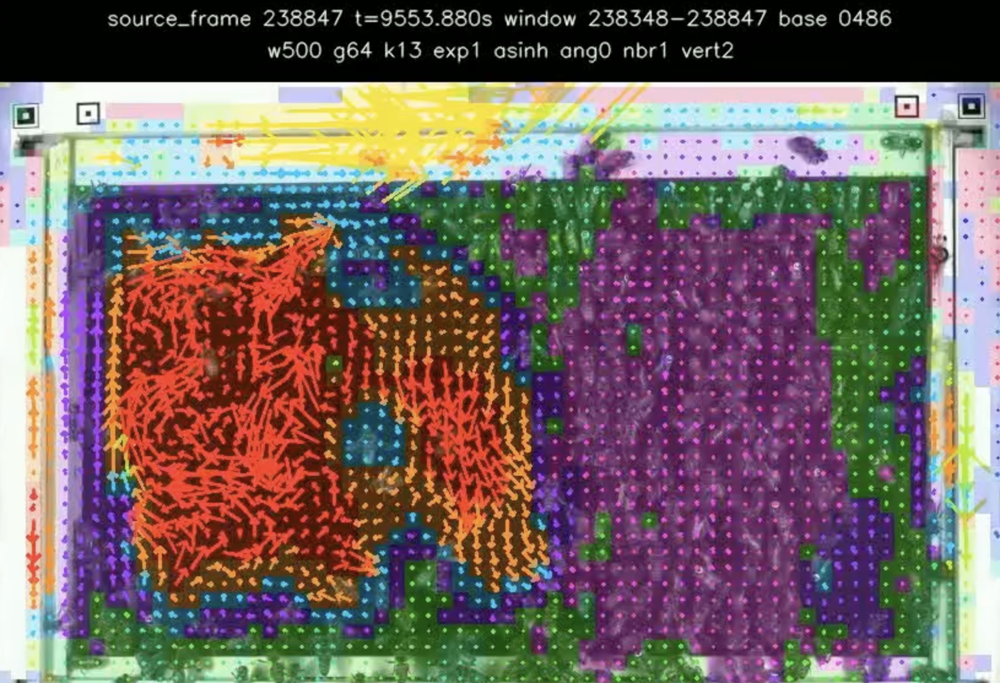

# Honeybee Hive Video

<!-- We want to be able to control image width and format, so: -->
<!-- markdownlint-disable-next-line MD033 -->


.

> This documentation is a work-in-progress

Video-processing and analysis tools for the [https://collective-logic-lab.github.io/](Collective Logic Lab's) honey bee collective behavior research project.

The current work focuses on comb-building and festoon-related behavior in the "Videos for honey bee lifetime tracking data 2019" dataset published by Smith et al. (2019), with related context from Neubauer et al. (2023), "Honey Bee Drones Are Synchronously Hyperactive inside the Nest." DOIs: [10.17617/3.LLWRWR](https://doi.org/10.17617/3.LLWRWR) for the dataset and [10.1016/j.anbehav.2023.05.018](https://doi.org/10.1016/j.anbehav.2023.05.018) for the paper. The videos are here: [https://edmond.mpg.de/dataset.xhtml?persistentId=doi:10.17617/3.LLWRWR](https://edmond.mpg.de/dataset.xhtml?persistentId=doi:10.17617/3.LLWRWR).

The present repository is a sister to another project repo from the Collective Logic Lab: [honey-bee-behavior](https://github.com/Collective-Logic-Lab/honey-bee-behavior)

## Scientific Questions

While we are interested in many aspects of the hive behavior, one heretofore poorly understood organizational regime within the hive is the festoon. [TODO: INSERT REFERENCES] Questions about festooning include:

1. Can we segregate festoon and non-festoon regimes? With what temporal tolerances? With what error tolerances? With what accuracy?
2. Can we locate the places in the hive where the festoon is happening, when it happens? And with what accuracy? Can we automate the location and with what error tolerances?
3. During festooning periods, what general and temporal characteristics describe the individual bees in the colony as a whole, and also bees within the festoon as well?
4. How can we characterize, if at all, the period leading up to the festoon as being distinct from non-festoon, non-transition periods?
5. If we think of the festoon as a behavior regime, what triggers the switch to the new regime?

## Extensions beyond Github and the development environment

**Data Companion: Huggingface**
This repository works with video files at that are extremely large. As a lab, we store processed files in [huggingface.co](hf.co) buckets. Data that we have processed for this repo lands at [https://huggingface.co/buckets/collective-logic-lab/honey-bee](https://huggingface.co/buckets/collective-logic-lab/honey-bee). Note that this repository contains a data/ directory with a few empty (and `.gitkeep`-ed) folders.

**Data Processing, Slurm, and ASU High Performance Computing**
Many of the processes in this repository are computing resource-intensive. Most of them will run on a high-end Macbook wtih 64GB for RAM, but practically speaking, high performance computing is useful for any kind of scale (and, since we are working with videos that last hours, one file represents a reasonably large such scale.) To supply sufficient computing resources, our experimental pipelines are designed for the [ASU Sol Supercomputer](https://docs.rc.asu.edu/supercomputer-hardware). The Sol job array software tool is [Slurm](https://slurm.schedmd.com/), and our scripted runs call Slurm using `bash` commands.

## Repository Organization

Here is the directory organization for the top two levels:

```sh
├── data                    # All code will expect data to live here, whether permanent or transient
│   ├── artifacts           # "Official" work products derived from the code.
│   ├── experiments         # Working and work-in-progress data; quality control
│   └── raw                 # This should only be raw video files. Download Edmonds files to here. Comes with a sample file.
├── docs                    # Project documentation
│   └── agent-generated     # Documents that are entirely or near-entirely generated by LLM agents
├── experiments             # Coding experiments and general noodling with tools
│   └── agent-assisted      # AI assisted experiments; can become very volumnious
├── notebooks               # Python notebooks that help explain the project
├── src                     # "Official" project source code. This material would definitely be submitted with a paper.
│   ├── analyze             # This code analyzes the videos to assign various features related to our scientific questions.
│   ├── hive_video          # Installable package: fragment, download, and staged resequencing
│   ├── pipeline            # Scripts for batch experimentation
│   └── utils               # Various shared functions
└── tests                   # Python tests
```

Note the `agent-` prefixed folders in some spaces. While coding agent assistance can be used elsewhere in the repository, these folders are provided in particular for agent-generated material that may not have yet been reviewed and assimilated by human investigators. Below we cover some additional coding agent topics.

## Getting Started

Depending on your use case, you can use the installable tools to perform various utility functions on the videos, or you could use the analysis section to review and extend our exploration of hive behavior and festooning.

### Getting Started: Hive Video Installable Tools

The `hive-video` package provides three video tools: `download` retrieves source videos from the archive, `resequence` runs the reconstruction and review stages, and `fragment` extracts individual frames or short clips. It also provides Python APIs for use in another project, including `honey-bee-behavior`.

Install the package using Python 3.12 or newer:

```bash
uv tool install hive-video
hive-video --help
```

This installs downloading and fragment extraction in an isolated environment managed by `uv`, with `hive-video` available as a shell command. If `uv` reports that its tool directory is missing from `PATH`, run `uv tool update-shell` and open a new terminal. To include resequencing dependencies, use this installation command instead:

```bash
uv tool install 'hive-video[resequence]'
```

FFmpeg and ffprobe are prepared automatically when fragment extraction or a resequencing media stage first needs them. The tools use an explicitly configured pair or a complete pair on `PATH`; otherwise, the included `portable-ffmpeg` provider downloads and caches platform-specific builds from the FFmpeg 8 family. Run `hive-video setup-ffmpeg` before offline media work to prepare both executables and report their actual versions and checksums. Help and archive downloading do not need FFmpeg.

For Python API access in another `uv` project, run `uv add 'hive-video[resequence]'` from that project. In an already activated virtual environment, use `uv pip install 'hive-video[resequence]'`. Omit `[resequence]` when you only need downloading and fragments.

The tools work with your local videos. To try the five-second sample included in this repository, clone it as described under [Prerequisites](#prerequisites) and run this command from the checkout root:

```bash
hive-video fragment \
  --video data/raw/start04_sample_5s.mp4 \
  --start-frame 0 \
  --out data/artifacts/fragments/start04_frame0.png
```

This writes the first frame as a PNG and a JSON provenance sidecar. Add `--duration-frames 25` and choose an `.mp4` output to extract the first 25 frames instead. Existing outputs are refused. The bee progress display can be changed with `--progress plain` or disabled with `--progress off`.

To select a full archive recording, resolve its locator first:

```bash
hive-video download \
  --locator start4_side1_top --target data/raw --resolve-only
```

Resolution retrieves the archive listing when needed and reports the selected video's identity, size, and destination. Remove `--resolve-only` to download it; full recordings can be tens of gigabytes. Resequencing is computationally expensive and includes source-cut inspection and join QC. Start with `hive-video resequence --help`, then follow the [resequencing workflow](docs/agent-generated/resequencing.md). Cluster launches use the tracked copy-and-edit template [resequence_pipeline_sample.sh](src/pipeline/slurm/resequence/resequence_pipeline_sample.sh). The [package interface guide](docs/agent-generated/package-interface.md) covers stage commands, approval requirements, and Python examples.

### Getting Started: Hive Video Analysis

The analysis code lives in this checkout under `src/analyze/`, with exploratory work under `experiments/agent-assisted/`. From the repository root, install the development and research dependencies and preview the small example preset:

```bash
uv sync --locked
uv run --no-sync python src/analyze/run_analysis.py example_5s_beginner \
  --video data/raw/start04_sample_5s.mp4 \
  --out data/experiments/my_first_analysis \
  --dry-run
```

The preview prints the resolved command and writes `analysis_run.json` without computing optical flow or clustering. Remove `--dry-run` to run the example. It uses the included five-second clip, so no additional data download is needed. Use a new output directory for each new experiment.

The run produces `motion_regime_features.csv`, `motion_regime_overlay.mp4`, and `metadata.json` alongside the preset record. Each feature row describes a grid cell over a time window; the overlay colors show clusters of local motion. These are exploratory groupings, and interpreting them as festooning or another bee behavior requires separate validation. Existing example outputs can be inspected in [data/experiments/experiment_example_5s](data/experiments/experiment_example_5s).

Presets and their parameters are defined in [run_analysis.py](src/analyze/run_analysis.py). The [analysis guide](src/analyze/README.md) describes features, controlled parameter changes, sampled runs, and chunked processing. Consult the [methods record](docs/agent-generated/METHODS.md) for recorded decisions and limitations before extending an analysis. The notebooks are still being developed; the preset runner is the current starting point for a runnable example.

### Prerequisites

We use [uv](astral.sh/uv) for package management. While it is not mandatory to use `uv` in order to operate the modules, our support for other package managers is limited. In return, we'll attempt to be as explicit as possible about `uv` steps. It may go without saying, but you'll also (very!) likely want `git` to work with the repository. For analysis, source development, or the included sample video, clone the repo with the following command line directives:

```bash
git clone https://github.com/Collective-Logic-Lab/honeybee-hive-video
# and then you'll want to move to that directory, e.g.:
cd honeybee-hive-video
```

Follow the installation steps above for your use case. `uv tool install` manages the command-line tools in its own isolated environment. For analysis, `uv sync --locked` creates this checkout's `.venv` with the dependencies from `pyproject.toml` and the lockfile; run the project's scripts with `uv run`.

> **Note:** Please do not edit the dependencies in the `pyproject` file, as they are usually managed automatically using `uv` commands.

### Data Seeding Script

A seed directory is hosted on the Huggingface bucket that provides example files and limited data for development and testing. In order to download data that will allow the included notebooks to run, you can run our getter script:

```bash
cd hive_video
uv venv
source .venv/bin/activate
uv sync
uv run python utils/get_dist_1.py
```

Note that **even though these data are limited, this is still a 22GB download**. Data will "land" in the `data` directories.

## Developing with Hive Video Tools

You can use the tools directly from Python in another project, including `honey-bee-behavior`. From the root of the project that will import the library, add it as a dependency:

```bash
uv add hive-video
```

Use `uv add 'hive-video[resequence]'` to include resequencing support. This records the dependency in your project's `pyproject.toml`, updates its `uv.lock`, and installs the library in its environment. Commit both files with your project. Python imports use this environment, so add the dependency even if you have already installed the separate CLI with `uv tool install`. The distribution is named `hive-video`; Python imports use `hive_video`.

For example, download the video from day 22, side 0, top panel into a local folder, then generate ten 30-second clips (fragments) starting consecutively:

```python
from pathlib import Path

from hive_video.download import download_video
from hive_video.fragment import create_fragment

my_dir = Path("data/day22")

source = download_video(day=22, side=0, panel="top", target=my_dir)

dur = 30

for i in range(10):
    clip = create_fragment(
        source,
        my_dir / f"clip_{i:02d}.mp4",
        start=i * dur,
        duration=dur,
        unit="seconds",
    )
    print(clip)
```

Run it with `uv run python extract_clip.py`. Change `my_dir` to choose where to save the video and clips; the downloader creates the folder if needed. Here, `day=22` selects archive capture `start22`; the timestamp in the resolved filename gives its calendar date. Downloading retrieves the complete source video before extracting clips, so it requires space for the full archive file. The overlapping clips start at 0, 30, …, 270 seconds on the source's nominal frame clock and are saved alongside the source video.

Each fragment call returns the absolute output `Path` and writes a `.mp4.json` sidecar beside its clip with provenance and a checksum. Fragment extraction refuses existing output files or sidecars. To extract one frame, omit `duration` and choose a `.png` output. Fragment failures raise ordinary Python exceptions; an optional `on_progress(stage, completed_frames, total_frames)` callback lets your application receive progress, with unknown counts reported as `None`.

`download_video` resolves the selection, caches the archive listing, and returns the local path used by `create_fragment`. The server, dataset DOI, and transfer settings default to those used by the CLI. With the defaults `verify=True` and `force=False`, a local copy matching the archive's size and MD5 is reused; a mismatched copy is downloaded again. Add `on_message=print` to report transfer progress. The [Python API examples](docs/agent-generated/package-interface.md#python-access) cover configurable transfer settings, inspecting a recording before downloading it, and the resequencing helpers.

Resequencing exposes individual stage helpers under `hive_video.resequence`. To invoke its stage procedures from Python, use `hive_video.resequence.cli.main(argv)`, which retains the command-line argument contracts and console output. Its `render` stage applies the existing QC and approval checks; callers of the lower-level renderer must validate those inputs themselves. Follow the [resequencing workflow](docs/agent-generated/resequencing.md) when combining stages. Your application supplies its own data and output paths; this repository's internal analysis and Slurm launchers are maintained separately from the installed package.

FFmpeg and ffprobe are resolved automatically for Python calls too. First-use binary downloads report progress to stderr. Before offline work, run `uv run hive-video setup-ffmpeg` in the consuming project so its environment has the required executables available.

## Coding agents

This repository is designed to enable the production of scientific understanding with inputs by both human and artificial agents. All coding agents should refer to the `AGENTS.md` file before continuing to process. Note that we do *not* use hidden dot-files like `.claude/` for agent instruction at this time, as we think that these instructions should be easily visible to humans and machines alike.

To-date, the primary coding agents that have been used on this repository are codex/gpt-5.5 and codex/gpt-5.6-sol, generally on higher reasoning settings. Gemini Flash (3.5, 3.7, 3.8) is also used from time to time for basics like formatting.

For humans, one important thing to know is that we will try and keep the markdown documentation (like this file) as well as any notebooks as primarily human-generated.
